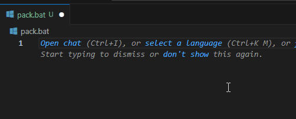

# BAT Path IntelliSense

为 Windows 批处理文件（`.bat` / `.cmd`）提供**文件与目录路径自动补全**的 VS Code 扩展。

写 `copy`、`xcopy`、`del`、`call` 这类命令时，只要输入 `.\`、`..\`、`C:\` 或 `\\server\share\`，
就会自动列出对应目录下的文件和文件夹。



## 功能特性

- **自动补全**：输入路径分隔符后弹出候选列表，`Ctrl+Space` 也可手动唤出。
- **多种路径形式**：相对路径（`.\`、`..\`、`sub\`）、绝对路径（`C:\...`）、UNC 网络路径（`\\server\share\...`）。
- **目录优先插入**：补全目录时自动补上结尾的 `\`，光标停在其后，可继续敲下一级。
- **引号内同样生效**：`call "C:\tools\` 也能触发。
- **大小写不敏感**：匹配前缀时忽略大小写，与 Windows 文件系统行为一致。
- **可配置**：可关闭自动触发，或只显示目录 / 只显示文件。

## 使用示例

```bat
@echo off

rem 输入 .\ 后列出当前脚本所在目录的内容
copy .\
rem      ↑ assets\  scripts\  readme.txt  ...

rem 逐级深入，目录补全后光标停在反斜杠之后
xcopy /E /I .\src\

rem 引号里的路径一样有补全
call "C:\tools\

rem 绝对路径
del D:\temp\

rem UNC 网络路径
dir \\nas\share\
```

## 安装

在 VS Code 的 **扩展** 面板搜索 `BAT Path IntelliSense`，或按 `Ctrl+P` 运行：

```
ext install nicehero.bat-path-intellisense
```

也可以直接访问
[Marketplace 页面](https://marketplace.visualstudio.com/items?itemName=nicehero.bat-path-intellisense)。

### 从源码运行

见下方[开发](#开发)一节，用 `F5` 启动扩展开发宿主即可。

## 配置项

在 **设置** 中搜索 `batPathIntelliSense`，或直接编辑 `settings.json`：

| 配置 | 类型 | 默认值 | 说明 |
| --- | --- | --- | --- |
| `batPathIntellisense.autoTrigger` | `boolean` | `true` | 输入路径时自动弹出建议；关闭后仅 `Ctrl+Space` 手动触发。 |
| `batPathIntellisense.showFiles` | `boolean` | `true` | 在建议列表中显示文件。 |
| `batPathIntellisense.showDirectories` | `boolean` | `true` | 在建议列表中显示目录。 |

```jsonc
{
  // 只补全目录，不显示文件
  "batPathIntellisense.showFiles": false
}
```

## 工作原理

1. 读取光标所在行、光标之前的文本，用正则提取出「看起来正在输入的路径」（从最后一个空白或引号之后开始）。
2. 以**当前 `.bat` 文件所在目录**为基准解析该路径，得到「要扫描的目录」和「正在输入的文件名前缀」两段。
3. `fs.readdirSync` 扫描该目录，按前缀（忽略大小写）过滤，生成补全项；目录项插入时会追加 `\`。

## 已知限制

- **不展开变量**：`%TEMP%`、`%USERPROFILE%`、`%~dp0` 等不会展开，因此这类路径没有补全。
- **不支持 `for` / `set` 变量**：`%%i\`、`%MYDIR%\` 无法解析。
- **只按前缀匹配**：不做模糊匹配；且目标目录必须真实存在才会给出建议。
- **基准目录固定**：相对路径基于 `.bat` 文件自身所在目录解析，不是工作区根目录，也不是终端当前目录；未保存（无磁盘路径）的文件不触发补全。
- **不做权限与网络探测**：无权限或离线的网络路径会静默返回空结果。

## 开发

```bash
npm install
npm run compile     # 编译到 out/
npm run watch       # 增量编译（F5 调试时自动使用）
```

在 VS Code 中按 `F5`，选择 **Run Extension**，会打开一个已加载本扩展的扩展开发宿主窗口；
在其中新建并保存一个 `.bat` 文件，输入 `.\` 即可看到补全效果。

主要文件：

- `src/extension.ts` — 补全逻辑全部在此（路径提取 + 目录解析 + 生成补全项）
- `package.json` — 扩展清单：语言注册、配置项、入口 `./out/extension.js`
- `.vscodeignore` — `vsce` 打包时的排除清单

## 打包

```bash
npx @vscode/vsce package
```

生成 `bat-path-intellisense-<version>.vsix`。

若要发布到 [VS Code Marketplace](https://marketplace.visualstudio.com/)，
需先把 `package.json` 里的 `publisher` 改成你自己的发布者 ID，
并补上 `repository` 字段（或给 `vsce` 传 `--allow-missing-repository`）。

## 许可证

MIT，详见 `LICENSE` 文件。
